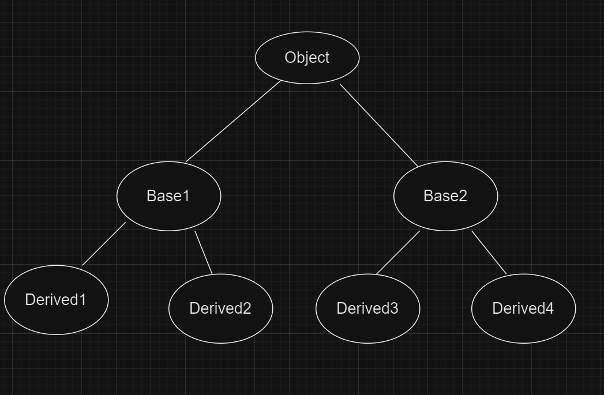

## Object TypeCasting rules -


```
public class ObjectTypecasting {

    public static void main(String[] args) {
        // Example-1
        Object o = new String("Object Typecasting");

        StringBuffer sb = (StringBuffer) o;
       // A           b  = (C)            d;

        // Example-2
        String s = new String("Object Typecasting");

        StringBuffer sb1 = (StringBuffer)s;
        // A           b  = (C)            d;

        // Example-3
        String s1 = new String("Object Typecasting");

        String sb2 = (String)s1;
        // A    b  = (C)      d;
    }
}

```

##### **A   b = (C) d;**

##### Compile Time Checking - 2 Rules

1. **TypeCasting**: The type of "d" and type of "C" must be Either Child to Parent or Parent to Child or Same Type. Otherwise compile time error will be thrown like Inconvertible Type.
2. **Type Reference**: The type of "C" must be equal to "A" or child type of "A" then compile time error will be thrown.
3. JVM-Runtime Rule: The runtime object type of "d" or Internal/Original Object( inside/assigned to "d") must be either same as "C" or child type i.e derived type of "C", otherwise we will get Runtime Exception - ClassCastException.

Example-1: "C" is child of "d" have relationship. Hence Typecasting will pass.

Type of "C" is equal to "A". Hence compilation will pass.

Original Runtime Object in "d" is of String type( Object <- String ). So for example-1

String is not equal to or derived type of StringBuffer.

Example-2: Type of "d" and "C" doesn't have Parent to child or child to parent or same type relation. Hence compile time error will be thrown at typecasting.

Original Runtime Object in "d" is of String type( Object <- String )

String is not equal to or derived type of StringBuffer.

Example-3: Type of "d" and "C" have same type. Hence no compile time error will be thrown at typecasting.

Original Runtime Object in "d" is of String type( String <- String )

Type of "d" is equal to "C" i.e is Strings.

1. Case Study:

   
2. Case Study:
3. Case Study:


## Constructors:
