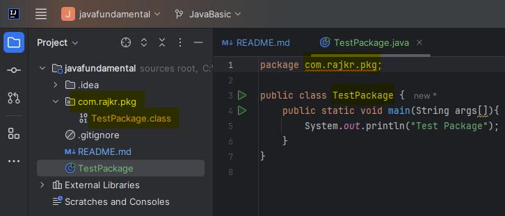

# **Java Fundamental**

## Java Source File Structure

#### Public Class In a File

A file can have multiple Java Classes. But maximum one class can be public.

If anyone of the class is public in a file then file can be saved with public class name.

#### No Public Class In a File

If no class is public then file can be saved with anyname.

#### Import Statement

For Best practices or readability always go with Explicit Import instead of Implicit Import. For example -

Best( Explicit Import ) => import java.util.ArrayList

Bad( Implicit Import ) => import java.util.*

Import statement, is not required for classes, packages etc if they are in same/current working directory.

Whatever available in "java.lang.*" packege, import statement is not required because by default they are available.

*Whenever we are importing a package ("import java.* ") then all classes, packages, interfaces inside package are available except sub-package for example" import java.* "  => Here java is a package. so all classes, interfaces and packages will be available from java package but not sub package classes like util" import java.util.* " => Here util is a sub-package inside java package. so all classes, interfaces and packages will be available from java.util package but not sub package like regex" import java.util.regex.* " => Here regex is a sub-package inside java.util sub-package.*

### Package

Package is a group of related classes, interfaces. For example java.io package

Package is best example of encapsulation

It improves modularity. Below is best example of Date class. we can have more then one classes with same name and they can belong to some related package. so it improves modularity

```
import java.util.Date
import java.sql.Date
```

it improves readiblity

it improves security. Related classes, interfaces inside package can access it's own content but outsider won't be able to access it.

Steps to compile package: -

1. javac TestPackage.java

. class file will be generated in CWD

2. javac -d . TestPackage.java ( . => CWD, we can specify any directory for example - javac -d D: TestPackage.java)
   This will put .class file in CWD com.rajkr.pkg

   
3. Run a package
   java com.rajkr.pkg.TestPackage
4. Maximum one package declaration statement is allowed in a Java Program file
5. Order to create a package: firstly Max one package statement > 2ndly Any no of import statement > lastly Any no of: Class | Interface | Enum

## Top level Class Modifiers( public, default, abstract, final, strictfp ):

`class Top {class Inner{}}`

#### Access:

public => Class accesible from anywhere.

default => Class accesible within the same package.

#### Object Creation:

**abstract**: Object creation( or Instance creation ) is not possible for abstract class.

**non-abstract**: Object creation( or Instance creation ) is possible if class is not abstract.

**final**: If class is final, then child class creation is not possible.

**not final**:  If class is not final, then child class creation is possible.

## Inner Class level Modifiers( *public, default, abstract, final, strictfp*, **private, protected, static** ):

`class Top {class Inner{}}`

## Abstract(-> Incomplete )  Modifier

Applicable for

1. Methods - Abstract Methods ends with semicolon not with curly bracket; Child classes are reponsible for implementation of the abstract methods.
   Valid signature is - `public abstract int getInterstRate();`

```
public class Vehicle { 
 public abstract int getNoOfWheels();  // Vehicle wheels is unknown because it can be 2, 3, 4, etc
}

public class Fruits{
 public abstract string getTaste();  // Taste is unknow because it depends on fruit
}

public class Loan{
 public abstract int getInterstRate();  // Interest is is unkown because it depends on loan type like Education loan, Home Loan, Personal Loan etc
}

```

2. Class - we can declare a class as *abstract* if we feel implementation is incomplete. Like a class implementation can be incomplete or a method can have incomplete implementation.
   Object Creation( Instantation ) is not allowed for Abstract class.


3. Difference between abstarct method and abstract class:
   If a class has at least one abstract method then class must be declared as Abstract class. So object creation is not possible.
   If a class doesn't have abstract method even though that class can be declared as Abstarct class.
   If child class is not abstract and it extends some abstract class then all abstract method of abstract class has to be implemented by Child Class( If it is not abstract)

   If child class is abstract and it extends some abstract class then all abstract method of parent abstract class not required to be implemented by Child Class( If it is abstract).

   But make sure at any level Object creation is not possible if that class is abstract even though it has implemented it's parent abstract method.

```

abstract class Vehicle {
 public int getNoOfWheels(){
 };  // here implementation is incomplete so this class can be declared as abstract class
}

abstract class Fruits{
public abstract string getTaste();  // Taste is abstract method so class must be declared as abstract class
}

// If Parent class is abstract and it has abstract method. so next child class must implements the abstract methods otherwise Compile time error will be thrown
abstract class Test {
 public abstract void m1();
 public abstract void m2();
}
// Object creation is not possible for ChildTest class because complile time error will be thrown
class ChildTest extends Test {
 public void m1() {}; // Complile time error for m2() method-> so implement m2: public void m2() {};  or declare ChildTest as Abstract also
}

// Object creation is possible for ChildTest class because it has implemented it's parent abstract methods, m1 & m2
class AnotherChildTest extends Test {
 public void m1() {}; 
 public void m2() {};
}
```
