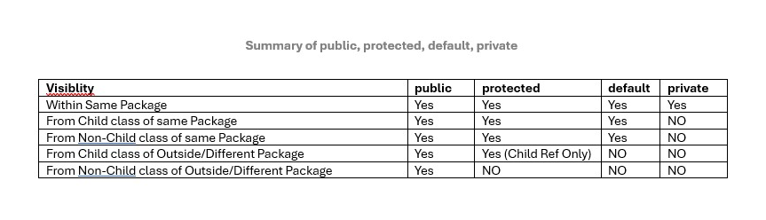
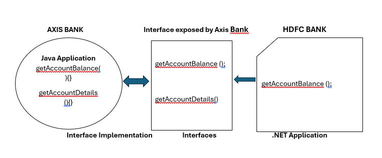
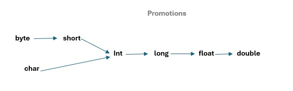
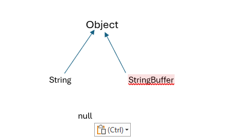
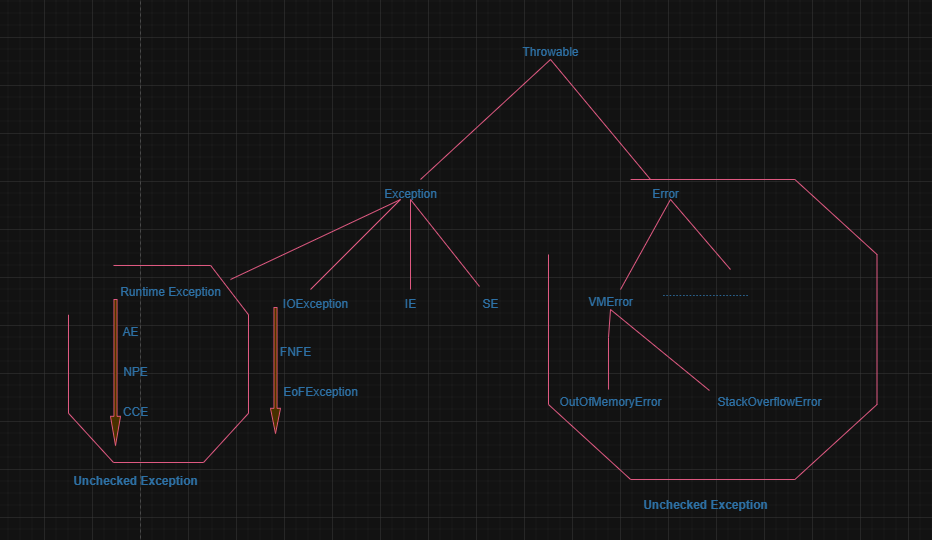

# Object Oriented Programming (OOPs) for JAVA Interviews

1. Java Source File Structure
2. Import Statement
3. Package Statement
4. Class Level Modifiers
5. Abstract Method
6. Abstract class
7. Member Modifiers
8. Interfaces
9. Data Hiding
10. Abstraction
11. Encapsulation
12. Tightly Encapsulated Class
13. Inheritance
14. Importance of Inheritance
15. Types of Inheritance
16. Multiple Inheritance
17. Cyclic Inheritance
18. Method Signature
19. Overloading
20. Method Overriding
21. Method Hiding
22. Polymorphism
23. Object Typecasting
24. Constructors

### Java Source File Structure

#### Public Class In a File

A file can have multiple Java Classes. But maximum one class can be public.

If anyone of the class is public in a file then file can be saved with public class name.

#### No Public Class In a File

If no class is public then file can be saved with anyname.

#### Import Statement

For Best practices or readability always go with Explicit Import instead of Implicit Import. For example -

Best( Explicit Import ) => import java.util.ArrayList

Bad( Implicit Import ) => import java.util.*

Import statement, is not required for classes, packages etc if they are in same/current working directory.

Whatever available in "java.lang.*" packege, import statement is not required because by default they are available.

*Whenever we are importing a package ("import java.* ") then all classes, packages, interfaces inside package are available except sub-package for example" import java.* "  => Here java is a package. so all classes, interfaces and packages will be available from java package but not sub package classes like util" import java.util.* " => Here util is a sub-package inside java package. so all classes, interfaces and packages will be available from java.util package but not sub package like regex" import java.util.regex.* " => Here regex is a sub-package inside java.util sub-package.*

### Package

Package is a group of related classes, interfaces. For example java.io package

Package is best example of encapsulation

It improves modularity. Below is best example of Date class. we can have more then one classes with same name and they can belong to some related package. so it improves modularity

```
import java.util.Date
import java.sql.Date
```

it improves readiblity

it improves security. Related classes, interfaces inside package can access it's own content but outsider won't be able to access it.

Steps to compile package: -

1. javac TestPackage.java

. class file will be generated in CWD

2. javac -d . TestPackage.java ( . => CWD, we can specify any directory for example - javac -d D: TestPackage.java)
   This will put .class file in CWD com.rajkr.pkg

   
3. Run a package
   java com.rajkr.pkg.TestPackage
4. Maximum one package declaration statement is allowed in a Java Program file
5. Order to create a package: firstly Max one package statement > 2ndly Any no of import statement > lastly Any no of: Class | Interface | Enum

## Top level Class Modifiers( public, default, abstract, final, strictfp ):

`class Top {class Inner{}}`

#### Access:

public => Class accesible from anywhere.

default => Class accesible within the same package.

#### Object Creation:

**abstract**: Object creation( or Instance creation ) is not possible for abstract class.

**non-abstract**: Object creation( or Instance creation ) is possible if class is not abstract.

**final**: If class is final, then child class creation is not possible.

**not final**:  If class is not final, then child class creation is possible.

## Inner Class level Modifiers( *public, default, abstract, final, strictfp*, **private, protected, static** ):

`class Top {class Inner{}}`

## Abstract(-> Incomplete )  Modifier

1. Applicable for Methods - Abstract Methods ends with semicolon not with curly bracket; Child classes are reponsible for implementation of the abstract methods.
   Valid signature is - `public abstract int getInterstRate();`

```
public class Vehicle { 
 public abstract int getNoOfWheels();  // Vehicle wheels is unknown because it can be 2, 3, 4, etc
}

public class Fruits{
 public abstract string getTaste();  // Taste is unknow because it depends on fruit
}

public class Loan{
 public abstract int getInterstRate();  // Interest is is unkown because it depends on loan type like Education loan, Home Loan, Personal Loan etc
}

```

2. Applicable for Class - we can declare a class as *abstract* if we feel implementation is incomplete. Like a class implementation can be incomplete or a method can have incomplete implementation.
   Object Creation( Instantation ) is not allowed for Abstract class.
3. Difference between abstarct method and abstract class:
   If a class has at least one abstract method then class must be declared as Abstract class. So object creation is not possible.
   If a class doesn't have abstract method even though that class can be declared as Abstarct class.
   If child class is not abstract and it extends some abstract class then all abstract method of abstract class has to be implemented by Child Class( If it is not abstract)

   If child class is abstract and it extends some abstract class then all abstract method of parent abstract class not required to be implemented by Child Class( If it is abstract).

   But make sure at any level Object creation is not possible if that class is abstract even though it has implemented it's parent abstract method.

```

abstract class Vehicle {
 public int getNoOfWheels(){
 };  // here implementation is incomplete so this class can be declared as abstract class
}

abstract class Fruits{
public abstract string getTaste();  // Taste is abstract method so class must be declared as abstract class
}

// If Parent class is abstract and it has abstract method. so next child class must implements the abstract methods otherwise Compile time error will be thrown
abstract class Test {
 public abstract void m1();
 public abstract void m2();
}
// Object creation is not possible for ChildTest class because complile time error will be thrown
class ChildTest extends Test {
 public void m1() {}; // Complile time error for m2() method-> so implement m2: public void m2() {};  or declare ChildTest as Abstract also
}

// Object creation is possible for ChildTest class because it has implemented it's parent abstract methods, m1 & m2
class AnotherChildTest extends Test {
 public void m1() {}; 
 public void m2() {};
}
```

5. When an abstract class is required to have abstract method -
   If you want each child to implement abstract method then please declare a abstract method in parent abstract class.

   ```
   abstract class Vehicle {
    public abstract int getNoOfWheels(){
    };
   }
   ```

   If implementation decision is dependent on child class in that case abstract method declaration is not required in parent abstract class.

   ```
   abstract class Vehicle {}
   ```

## Members(methods or variables) Modifiers =>  **public** & **default**

### public-Global Access & **default**-accessible within it's own package:

if a class is public then it can be accessed from anywhere.

```
// A.java  => javac -d . A.java
package pack1;

public class A {
    void m1() {
        Sopln("A class method");
    }
}

// B.java  => javac -d . B.java
package pack2;
import pack1.A;

public class B {
    public static void main(String args[]) {
        A a = new A(); // Compile time error will be thrown here
        a.m1();
    }
}
```

if a class is public but it's member are not public( for example it's default ) then its emeber can be accessed inside it's own package.

```
// A.java  => javac -d . A.java
package pack1;

public class A {
    void m1() {
        Sopln("A class method");
    }
}

// B.java  => javac -d . B.java
package pack2;
import pack1.A;

public class B {
    public static void main(String args[]) {
        A a = new A();
        a.m1(); // Compile time error will be thrown here
    }
}
```

if a class is public and it's members are also public then class can be accessed from anywhere.

```
// A.java  => javac -d . A.java
package pack1;

public class A {
    public void m1() {
        Sopln("A class method");
    }
}

// B.java  => javac -d . B.java
package pack2;
import pack1.A;

public class B {
    public static void main(String args[]) {
        A a = new A();
        a.m1();
    }
}
```

if a class is not public it can't be accessed from outside it's own package even though it's members are public.

```
// A.java  => javac -d . A.java
package pack1;

class A {
    public void m1() {
        Sopln("A class method");
    }
}

// B.java  => javac -d . B.java
package pack2;
import pack1.A;

public class B {
    public static void main(String args[]) {
        A a = new A();
        a.m1();
    }
}
```

### Private ( Accessible within it's own class ):

*Recommended modifier for Class Variables is PRIVATE*

*Recommended modifier for Class Methods is PUBLIC*

Private member(methods & data member/class variables) are accessible within it's own class.

```
class A {
    private void m1() {
        Sopln("A class private method");
    }
}

class Test {
    public static void main(String args[]) {
        A a = new A();
        a.m1(); // Compile Time error will be thrown - m1 has private access in A
    }
}
```

```
class A {
    private void m1() {
        Sopln("A class private method");
    }
}

public class Test {
    public static void main(String args[]) {
        A a = new A();
        a.m1(); // Compile Time error will be thrown - m1 has private access in A
    }
}
```

### Protected Modifiers( Access within it's own package i.e default + child class level access )

Within it's own package it can be accessed by Parent class reference, Child class reference

```

class A {
    public void m1() {
        Sopln("A class method");
    }
}

class B extends A {
    public static void main(String args[]) {
  
    }
}

// Allowed access ways are
A a = new A();
a.m1();

B b  = new B();
b.m1();

// Here B class have access m1 method in A. So using B class reference it can be accessed
A a1 = new B();
a1.m1()
```

##### Inside same package - Accessible by parent class refrence and Child class reference

```
// Both classes are in same package - pack1, A is parent class and B is Child class.       javac -d . A.java => java pack1.B
package pack1;
class A {
    protected void m1() {
        Sopln("A class protected method");
    }
}

class B extends A {
    public static void main(String args[]) {
        A a = new A();
        a.m1();

        B b = new B();
        b.m1();

        A a1 = new B();
        a1.m1();
    }
}
```

###### Outside package - Only within Child Class( by Child class reference only )

What if child class exist outside another Package - pack2

```
// Class A is in package - pack1, and Class B is in package- pack2
package pack1;

class A {
    protected void m1() {
        Sopln("A class protected method");
    }
}
---------------------------------------------------
package pack2;
import pack1.A;

public class B extends A {
    public static void main(String args[]) {
        A a = new A(); // Compile Time Error because of Parent refrence - m1 has protected access in pack1.A
        a.m1();

        B b = new B(); // Valid because of Child refrence is used
        b.m1();

        A a1 = new B(); // Compile Time Error because of Parent refrence - m1 has protected access in pack1.A
        a1.m1();
    }
}
```



## **Object Oriented Programming**

1. Interface -
2. Abstract Class

### INTERFACE - Interface is Any service requirement specification ( SRS )

- Any service requirement specification( SRS ) for example - SUN Microsystem provides JBDC API requirements(SRS) for Java Applicaation to interact with any database like Oracle, MySQL, PostgreSQL( All Database vendor have used SUN System SRS to develop database driver so that Java Application can interact) .
  If you want your java application to interact any new database then you have to follow the SUN Microsystem SRS to create driver which will interact with Database.
- Any contract b/w Client and Service Provider is also know as Interfaces

```
// By default Interface methods are public and abstract
// Modifier from Interface can't be narrowed(like public to default/protected/Private) by implemented Service class
interface CollegeInterface {
    public void attendance();
    public void absence();
    public void fee();
}

abstract class ServiceProvider implements CollegeInterface {
    /**
     * For All interface method we must be provide implementation and they must be public
     * If yoy are not able to provide the implementation of at least one method of interface then ServiceProvider class must be declared as abstract class
     * If any method implementation left then Sub Child class is responsible to implements the not implemented abstract method from interface
     */
    public void attendance() {

    };
    public void absence(){

    };
}

class SubServiceProvider2 extends ServiceProvider {
    /**
     * All method from interfaces must be implemented and they must be public
     * Here pending abstract public method from interface is implemented by SubServiceProvider2
     * 
     */

    public void fee(){

    };
}

```

## **Object Oriented Programming ( OOPS )** Features

### **Data Hiding** - Data hiding for security reason so that outsider can't access

***Private modifier*** can be user for data member for data hiding

```
interface Account {
    // Data hiding can be achieved by private modifier
    private double balance;

    public double getAccountBalance() {
        // perform validation for valid PIN credentails
        if ( isValidPIN )
          return balance;
        else 
            return error;
    }
}
```

### Abstraction - Hiding Internal implementation due to security reason

***Abstraction can be achieved by GUI and Interfaces***

For Example -> Bank hides internal implementation- like code and sql query, how user balanced is fetched by showing needed features using GUI.

Advantages of Abstraction:

* Security
* Enhancement becomes easy - Internal Implementation or technology can be changed because GUI and interfaces will remain same, So user and outside 3rd party services won't be affected
* Maintainaility is going to be improved
* Modularity is going to be improved



### Encapusalation (=> Data Hiding + Abstraction )

###### The process of encapsulating/groupping in a single class is called Encapusalation.

Every Java class is an example for Encapusalation.

Hiding data members behind the methods is called Encapusalation.

Big Disadvatnage is - Performance will decrease because length of the code will increase like validation that will increase execution time

```
// Here GUI ( Balance Enquiry, Deposit buttons) plays a role of abstraction and private modifier in a class plays data hiding role
class Account {
    // Data hiding can be achieved by private modifier
    private double balance;

    public double getAccountBalance() {
        // perform validation for valid PIN credentails
        if ( isValidPIN )
            return balance;
        else
            return error;
    }

    public void setAccountBalance(double amound){
        // perform validation for valid PIN credentails
        if ( isValidPIN )
            this.balance = this.balance + amound;
        else
            return error;
    }
}

```

#### Tightly Encapsulated Class(All variables in a class is declared as Private, we don't care about methods, it can have any applicable modifiers):

If parent class is not Tightly Encapsulated then all child will also become Non-Tightly Encapsulated class

Example - 1

```
//Tightly Encapsulated Class
class A {
   private int x = 10;
}

//Non - Tightly Encapsulated Class, because y is not private
class B extends A {
    int y = 20;
}

//Tightly Encapsulated Class
class C extends A {
    private int Z = 30;
}

```

Example - 2

```
//Non - Tightly Encapsulated Class, because x is not private
class A { 
    int x = 10;
}

//Non-Tightly Encapsulated Class, because Class B inherit class A, Hence x is also part of B
class B extends A {
  private int y = 20;
}

//Non-Tightly Encapsulated Class, because Class C inherit class B, Hence x, Y is also part of C
class C extends B {
    private int Z = 20;
}
```

### Inheritance:

1. Is-A Relationship
2. Code Reusability
3. extends keyword

Child class member cannot be part of Parent Class

All member of parent class will be available in child class

Parent reference can be used to hold child object. But using parent reference we can't call Child class members

Child reference can be used to hold child object. Child reference can call Parent class members

Parent reference can be used to hold child object. But using parent reference we can't call Child class members

Example-1

```
//Child class member cannot be part of Parent Class
class Parent {
    int x1 = 10;
    String s1 = "Parent Variable";

    public void m1() {
        System.out.println("Parent Method");
    }
}

//All member of parent class will be available in child class
class Child extends Parent {

    int y1 = 10;
    String t1 = "Child Variable";

    public void m2() {
        System.out.println("Child Method");
    }
}

class Test {
    public static void main(String[] args) {
        //Parent reference can be used to hold Parent object. Parent reference can only call it's parent class members but not child class members
        Parent p = new Parent();
        p.m1();
        p.m2(); // Error

        // Child reference can be used to hold child object. Child reference can call Parent class members
        Child c = new Child();
        c.m1();
        c.m2();

        // Parent reference can be used to hold child object. But using parent reference we can't call Child class members
        Parent parent = new Child();
        parent.m1();
        parent.m2(); // Error
    }
}
```

Note - 4300+ class are available in Java

1. Object class is the root class for all the classes in Java.
2. Object class is the root class for all Java classes because it contains all the common method which are required for any Java Class.
3. String, StringBuffer, Number, Math..... Throwable are direct child class of Object class
4. Throwable contains all common methods for Exception and Error class
5. RuntimeException(RE childs are => NullPointerException, ArithematicException etc), IOException etc are direct child of Exception class.
6. So, Exception class contains all common methods for RE, IOE etc
7. VMError, CompileTimeError, etc are direct child class of Error class.
8. So, Error class contains all common methods for VMError, CE etc

**Any class created by user will be direct child class of Object class only if it doesn't extends any other class**.

Example -

// Class A inherits Object class
Object => class A

// only class A inherits Object class but not B.

class B extends A

#### Types of Inheritance:

1. Single Inheritance: - Single child class inherits Single parent class is called Single Inheritance
2. Multiple Inheritance ( Not supported in Java class except Interface ):  - Single child class inherits multiple Parent class at a time is called Multiple Inheritance
3. Multi-level Inheritance: - Class A => Class B extends A => Class C extends B
4. Hierarchical Inheritance - A group of single inheritance is Hierarchical Inheritance.
5. Hybrid Inheritance ( Not supported in Java class except Interface - because interface contains only method declaration ) - Combination of two or more Inheritance types
6. Cyclic Inheritance ( Not supported in Java class or interface) - For example - Class A inherits B ,   Class B inherits A   i.e class A <=> class B

**Single Inheritance**

```
class Parent {
  
}

class Child extends Parent {
  
}
```

**Multiple Inheritance:** - Not supported because of Diamond Access problem or Ambiguity Problem

```
class A {
    public void m1() {
        System.out.println("Parent Method");
    }
}

class B {
    public void m1() {
        System.out.println("Parent Method");
    }
}

class C extends A,B{
    //which m1 method will be called. 
}
```

**Multi-level Inheritance**

```
class A {

}

class B extends A {

}

class C extends B {
  
}
```

**Hierarchical Inheritance**:

```
class Parent {
    public void m1() {
        System.out.println("Parent Method");
    }
}

class A extends Parent{
//Calling m1 method is possible without any error.
}

class B extends Parent{
//Calling m1 method is possible without any error.
}

class C extends Parent{
//Calling m1 method is possible without any error.
}
```

**Hybrid Inheritance**

```
class A {
    public void m1() {
        System.out.println("Parent Method");
    }
}

class B extends A {

}

class C extends B{
  
}

class D extends C{
    public void m1() {
        System.out.println("Parent Method");
    }
}

class E extends C {
    public void m1() {
        System.out.println("Parent Method");
    }
}

class F extends D, E {
  //which m1 method will be called. 
}
```

Hybrid Inheritance for Interface -

```
interface A {
    public void m1();
}

interface B {
    public void m1();
}

interface C extends A,B {

}

class D implements C {
    public void m1() {
        System.out.println("Parent Method");
    }
}
```

### Polymorphism ( Overloading -*is different method signature* & Overriding is - *same method signature* ):

**Method Signature** => ( Method name + Method Arguments ), not method return type. Compiler uses methods signature to resolve calls.
if calls does.t match, compile time error will be thrown.

*Two methods with same signature is not allowed in a class.*

#### Overloading(Same method name but different arguments type):

*we can assume Overloading is:* Compiler is responsible for method resolution based on object reference type( for example Test t = new Test() ).

1. Compile Time Polymorphism
2. Static Polymorphism
3. Early Binding

   ```
   class Test {
       public void m1() {
           System.out.println("No Args");
       }
       public void m1(int i) {
           System.out.println("int Args");
       }
       public void m1(double d) {
           System.out.println("double Args");
       }

       public static void main(String[] args) {
           Test t = new Test();
           t.m1();
           t.m1(10);
           t.m1(10.55);
       }
   }

   ```

**Case Study - 1**


```
class Test {
    public void m1(int i) {
        System.out.println("int Args Method");
    }
    public void m1(float d) {
        System.out.println("float Args Method");
    }

    public static void main(String[] args) {
        Test t = new Test();
        t.m1(10); // int Args Method
        t.m1(10.55f); // float Args Method

        // In overloading If exact method signature is not available then Compile time error won't be thrown here. Instead char will be promoted to next level i.e int. 
        // So, it will try to find matching method, i.e int args method exist it will get chance first. if it doesn't find, it keeps promoting till double. 
        // If matching method not found for last promotion i.e double then only compile time error will be thrown
        t.m1('a'); // int Args Method
        // long can be promoted to float
        t.m1(10l); // float Args Method
        // double promotion for next level is not applicable.
        t.m1(10.5); // Compile Time Error
  
    }
}
```

**Case Study - 2**

```
class Test {
    public void m1(Object o) {
        System.out.println("Object version");
    }
    public void m1(String s) {
        System.out.println("String version");
    }


    public static void main(String[] args) {
        Test t = new Test();
        t.m1(new Object()); // Object version
        t.m1("Raj"); // String version

        // Because String is direct child class of Object. Always child get's priority first and then Parent class
        // If String version doesn't exist then Object version will be called
        t.m1(null); // String version

    }
}

```

**Case Study - 3**



```
class Test {
    public void m1(String s) {
        System.out.println("String version");
    }
    public void m1(StringBuffer sb) {
        System.out.println("StringBuffer version");
    }
  
    public static void main(String[] args) {
        Test t = new Test();
        t.m1("Raj"); // String version
        t.m1(new StringBuffer("Raj")); // StringBuffer version

        // Ambiguous method call. Because String and StringBuffer are direct child of Object class
        // Candidates for method call t.m1(null) are: String and StringBuffer. So, compiler time error will be thrown.
        t.m1(null);
    }
}

```

**Case Study - 4** : ( defined arg method **>** var args method . if no matched args method matched then var-args-method will get chance)

```
class Test {
    public void m1(int i) {
        System.out.println("General method");
    }
    public void m1(int... i) {
        System.out.println("var arg method");
    }

    public static void main(String[] args) {
        Test t = new Test();
        // var arg int method will be call because it can accept min 0 args.
        t.m1(); // var arg int method
        t.m1(2,3); // var arg method

        // Both overloaded is eligible for single int arg. So, Old concept will get priority compared to new concept( var args came in 1.5 version)
        // So, General method will get priority
        t.m1(2); // General method
    }
}
```

**Case Study - 5**

```
class Test {
    //Same method with Change in argument order will be considered as overloaded method
    public void m1(int i, float f) {
        System.out.println("int-float version");
    }
    public void m1(float f, int i) {
        System.out.println("float-int version");
    }

    public static void main(String[] args) {
        Test t = new Test();
        // Here exact match will get chance
        t.m1(10, 20.5f); // int-float version
        t.m1(10.f, 20); // float-int version
  
        // Compile Time Error - Reference to t.m1 is ambiguous. Because
        t.m1(10, 10); //Both method matched.So, CompileTime Error
  
        // No method matched. So, CompileTime will be thrown
        t.m1(10.5f, 10.5f); //CompileTime Error
    }
}
```

**Case Study - 6**

At compile time left side -> Class Type Reference is taken into consideration for method resolution. That's why overloading is called Compile Time polumorphism

- Same class type can hold the instance of Same class ( ex- Animal a = new Animal() or Monkey m = new Monkey(); );
- Parent class type can hold the reference of Child class (ex- Animal a = new Monkey(); )
- Parent/Ancestor/Root class can hold the reference of child class or indirect child class at any level( ex- Object o = new Animal(); or Object o = new Monkey(); ).
- Child class type can't hold the reference of Parent/Root/Ancestor class Instance( for ex - Monkey m1 = new Animal(); ) .

```
class Animal { }

class Monkey extends Animal { }

class Test {

    public void m1(Animal a) {
        System.out.println("Animal Version");
    }

    public void m1(Monkey m) {
        System.out.println("Monkey Version");
    }

    public static void main(String[] args) {
        Test t = new Test();

        Animal a = new Animal();
        t.m1(a); // Animal Version

        Monkey m = new Monkey();
        t.m1(m); // Monkey Version

        // Animal a1 is going to reference to Animal Version because for Overloading is done at compile time. It doesn't care about runtime
        Animal a1 = new Monkey();
        t.m1(a1); // Animal Version

        // Same class Type or it's ancestor parent can hold the instance.
        Monkey m1 = new Animal(); // CE
        t.m1(m1);

        // Same class Type or it's ancestor Class( Object, Animal but not Monkey )  can hold the instance.
        Object o = new Animal(); // 
    }
}
```

#### **Overriding ( same method signature )**

At compile time left side -> Class Type Reference is taken into consideration for method resolution of parent and child class for overriding.
But runtime object/instance of class

- Runtime Polymorphism
- Dynamic Polymorphism
- Late Binding

Overriden Method - ( Parent class method which has been overriden by child class)

Overriding Method- ( Child class method which overrid by child class)

###### *Runtime Object method will be invoked for Overriding. But for compile time (i.e for overloading) Class Type reference will be used to resolve the reference.*

```
class Parent {
    public void property() {
        System.out.println("Gold, Silver, Money, Land");
    }

    // Overriden Method
    public void arrangeMarriage() {
        System.out.println("Arrange Marriage with Anupama Parameswaran");
    }
}

class Child extends Parent {
    // Overriding Method
    public void arrangeMarriage() {
        System.out.println("Arrange Marriage with Tamannaah Bhatia");
    }
}

class Test {

    public static void main(String[] args) {

        Parent p = new Parent(); // Runtime is Parent, so parent method will be invoked
        p.arrangeMarriage(); // Parent method

        Child c = new Child(); //Runtime is Child, so Child method will be invoked
        c.arrangeMarriage(); //Child method

        Parent p1 = new Child(); //Runtime is Child, so Child method will be invoked
        p1.arrangeMarriage(); // Child method

        // Child c1 = new Parent(); // incompatible types: Parent cannot be converted to Child
    }
}
```

##### Rules of Method Overriding:

##### - Mthod signature must be same( Name + Arguments types )

Same Return Types:

```
class Parent {
    public Object m1() {
        return null;
    }
}

class Child extends Parent {
    /**
     * Same return types are always allowed
     * @return
     */
    public Object m1() {
        return null;
    }
}
```

##### - Return Type( Must be Same until 1.4v, 1.5v onwards co-variants return types are allowed )

**Co-variant Return Types:** The **covariant return type is – when we override a method – what allows the return type to be the subtype of the type of the overridden method**.

Covariant types are direct or Indirect child of Parent Return types. For example here parent class method return type is Object, so child class method can have same retrun type

//Allowed

Parent Method Return Type => Object
Child Method Return Type => Object|String|StringBuffer|etc.

//Allowed

Parent Method Return Type => Number
Child Method Return Type => Number|Byte|Short|Integer|Long|Float|Double.

//Allowed

Parent Method Return Type => Number
Child Method Return Type => Number|Byte|Short|Integer|Long|Float|Double.

// Not allowed

Parent Method Return Type => String
Child Method Return Type => Object

Same or it's child class are allowed for child override method

C:/javac Parent.java

*Compile with Java 1.4 version*

C:/javac -source 1.4 Parent.java

```
class Parent {
    public Object m1() {
        return null;
    }
}

class Child extends Parent {
    /**
     * Object child are allowed here as return type. For example - String, StringBuffer, int, etc
     * @return
     */
    public Object m1() {
        return null;
    }
}
```

- Private methods are not visible in child classes. Hence Overriding concept is not applicable for Private methods.

  ```
  class Parent {
      private void m1() {

      }
  }

  class Child extends Parent {

      // Overriding is not possible, but we can have same method in child class
      private void m1() {

      }
  }
  ```
- Override is not allowed for Final methods. Compile time error will be thrown if override is done.

  ```
  class Parent {
      public final void m1() {

      }
  }

  class Child extends Parent {

      // final methods are not allowed to override. Even child class can't have same method as final. Compile time error will be thrown
      public void m1() {

      }
  }

  ```

  **Parent Methods  ================================================> Child Methods**
  final           ================================================> non-final/final    Not Allowed
  non-final       ================================================> final              Allowed
  abstract        ================================================> non-abstract       Allowed
  non-abstract    ================================================> abstract           Allowed( Child class will become abstract class. Next child class has to implement abstract method )
  synchronized    ================================================> non-synchronized   Allowed
  native          ================================================> non-native         Allowed
  strictfp        ================================================> non-strictfp       Allowed
- While overriding we can't narrow/reduce the scope of the access modifier. But we can brod/increase the scope.

  ```

  class Parent {
      public void m1() {

      }
  }

  class Child extends Parent {

      // Compile Time Error. Attempting to assign weaker access privileges
      protected void m1() {

      }
  }
  ```

  ```
  class Parent {
      protected void m1() {

      }
  }

  class Child extends Parent {

      // Broadening of access modifiers are allowed, protected to public done here
      public void m1() {

      }
  }
  ```

private < default < protected < public

- OVERRIDING RULES ( Unchecked Exception is not caught by Compiler. Except Unchecked all are Checked Exception )

  

  - **If child class method throws any Checked Exception then compulsory Parent class method or it's Child class should throw the same checked exception.
    There are no rule for UNCHECKED EXCEPTION**

    1. It's Valid, if child method doesn't throw Exception
       Parent - public void m1() throws Exception
       Child - public void m1(){ }

       ```
       class Parent {
           protected void m1() throws Exception {

           }
       }

       class Child extends Parent {

           public void m1() {

           }
       }

       ```
    2. It's Invalid. If child method throws checked Exception then it's Parent method must throws Checked Exception or it's Parent Checked Exception
       Parent - public void m1()
       Child - public void m1() throws Exception

       ```
       class Parent {
           protected void m1() {

           }
       }

       class Child extends Parent {

           public void m1() throws Exception {

           }
       }
       ```
    3. It's valid. Because parent method is throwing checked Parent Exception class and child method throws checked child Exception class.
       Parent - public void m1() throws Exception
       Child - public void m1() throws IOException

       ```
       import java.io.IOException;

       class Parent {
           protected void m1() throws Exception {

           }
       }

       class Child extends Parent {

           public void m1() throws IOException {

           }
       }

       ```
    4. It's Invalid. Because parent method is throwing checked Child Exception class and child method throws checked Parent Exception class.
       Parent - public void m1() throws IOException
       Child - public void m1() throws Exception

       ```
       import java.io.IOException;

       class Parent {
           protected void m1() throws IOException {

           }
       }

       class Child extends Parent {

           public void m1() throws Exception {

           }
       }
       ```
    5. It's valid. Because EoFException, FNFE are checked child Exception class of IOException.
       Parent - public void m1() throws IOException
       Child - public void m1() throws EoFException, FNFE

       ```
       import java.io.EOFException;
       import java.io.FileNotFoundException;
       import java.io.IOException;

       class Parent {
           protected void m1() throws IOException {

           }
       }

       class Child extends Parent {

           public void m1() throws EOFException, FileNotFoundException {

           }
       }
       ```
    6. It's Invalid. Because Interrupted Exception is not child Exception of IOException( overridden method does not throw 'java.lang.InterruptedException )
       Parent - public void m1() throws IOException
       Child - public void m1() throws EoFException, IE

       ```
       import java.io.EOFException;
       import java.io.IOException;

       class Parent {
           protected void m1() throws IOException {

           }
       }

       class Child extends Parent {

           public void m1() throws EOFException, InterruptedException {

           }
       }


       ```
    7. It's Valid.Because EoFException is child class of IOException. NPE is unchecked exception so it can be placed/thrown anywhere in class.
       Parent - public void m1() throws IOException
       Child - public void m1() throws EoFException, NPE

       ```
       import java.io.EOFException;
       import java.io.IOException;

       class Parent {
           protected void m1() throws IOException {

           }
       }

       class Child extends Parent {

           public void m1() throws EOFException, NullPointerException {

           }
       }
       ```
    8. It's valid. Because parent method throws IOException and child throws unchecked exception AE, NPE
       Parent - public void m1() throws IOException
       Child - public void m1() throws AE,NPE

       ```
       import java.io.EOFException;
       import java.io.IOException;

       class Parent {
           protected void m1() throws IOException {

           }
       }

       class Child extends Parent {

           public void m1() throws EOFException, ArithmeticException ,NullPointerException {

           }
       }
       ```
- Ovrriding w.r.t Static Methods( Class level methods can be overriden by Class level i.e static method, Object level method can be overriden by Object level Method i.e non-static )

  ```
  class Parent {
      public void m1() {

      }
  }

  class Child extends Parent {

      // Overriding method must be non-static too( Static method 'm1()' in 'Child' cannot override instance method 'm1()' in 'Parent')
      public static void m1() {

      }
  }
  ```

  ```
  class Parent {
      public static void m1() {

      }
  }

  class Child extends Parent {

      // Overriding method must be static too( Instance method 'm1()' in 'Child' cannot override static method 'm1()' in 'Parent)
      public void m1() {

      }
  }
  ```

  ```
  // Below is the concept of Method hiding. It's not overriding
  class Parent {
      public static void m1() {

      }
  }

  class Child extends Parent {
      public static void m1() {

      }
  }
  ```
- #### Method Hiding( Method hiding is taken care by Compiler and Overriding by Runtime-JVM)

```
// Method hiding will be taken care by Compiler. Below is not overriding
class Parent {
    public static void m1() {
        System.out.println("Parent");
    }
}

class Child extends Parent {
    public static void m1() {
        System.out.println("Child");
    }
}

class Test {
    public static void main(String[] args) {
        Parent p = new Parent();
        p.m1(); // Runtime instance is Parent Object.Hence Parent method will be invoked

        Child c = new Child();
        c.m1(); // Runtime instance is Child Object.Hence Child method will be invoked

        Parent parent = new Child();
        parent.m1(); // Runtime instance is Child Object.Hence Child method will be invoked
    }
}
```

##### Difference b/w Method Hiding and Overriding:

- **Method Hiding** -
  1. Both Parent class and child class method should be static.
  2. Method Resolution always taken care by compiler based on reference type
  3. Method hiding is a Compile Time Polymorphism or Static Polumorphism or Early Binding.
- **Overriding** -
  1. Both Parent class and child class methods should be non-static.
  2. Method Resolution always taken care by JVM based on Runtime Object.
  3. Overriding is Runtime Polymorphism or Dynamic Polymorphism or Late Binding.

##### Overriding w.r.t var-arg method( var-arg method can be override only by var-arg method, otherwise it will become Ovverloading ):

Overriding -  For overriding parent and child methods must have var-arg method

```
// Below is overriding because method argument are same
class Parent {
    // Var-Arg method
    public static void m1(int... i) {
        System.out.println("Parent");
    }
}

class Child extends Parent {
    // Var-Arg method. Hence it's overriding. So method resolution will be taken care by runtime/JVM 
    public static void m1(int... i) {
        System.out.println("Child");
    }
}

class Test {
    public static void main(String[] args) {
        Parent p = new Parent();
        p.m1(10); //Runtime instance is Parent Object.Hence Parent method will be invoked

        Child c = new Child();
        c.m1(10); // Runtime instance is Child Object.Hence Child method will be invoked

        Parent parent = new Child();
        parent.m1(10); // Runtime instance is Child Object.Hence Child method will be invoked
    }
}
```

Overloading:

```
// Method hiding will be taken care by Compiler. Below is not overriding because method argument are different so it's Overloading
class Parent {
    // Var-Arg method
    public static void m1(int... i) {
        System.out.println("Parent");
    }
}

class Child extends Parent {
    // Normal method. Hence it's Overloading not overriding. So method resolution will be taken care by compiler with reference type
    public static void m1(int i) {
        System.out.println("Child");
    }
}

class Test {
    public static void main(String[] args) {
        Parent p = new Parent();
        p.m1(10); //Reference type is Parent.So Parent method will be invoked

        Child c = new Child();
        c.m1(10); // Reference type is Child.So Child method will be invoked

        Parent parent = new Child();
        parent.m1(10); // Reference type is Parent.So Parent method will be invoked
    }
}
```

#### Overriding concept is only applicable for methods not variables:

Variables resolution is always taken care by Compiler based on reference type whether Parent/Child variable is static or non-static.

Declaring same variable in parent and child class is known as **Variable Hiding or Shadowing**

```
// Variables resolution is always taken care by Compiler based on reference type whether variable is static or non-static.
class Parent {
    String s = "Parent";
}

class Child extends Parent {
    String c = "Child";
}

class Test {
    public static void main(String[] args) {
        Parent p = new Parent();
        System.out.println(p.s); // Reference type is Parent.So Parent variable will be invoked


        Child c = new Child();
        System.out.println(c.s); // Reference type is Child.So Child variable will be invoked

        Parent parent = new Child();
        System.out.println(parent.s); // Reference type is Parent.So Parent variable will be invoked
    }
}
```

#### Comparision between Overriding and Overloading

Property ----------------- -----------Overloading------------------------------------------Overriding.............................

Method Names--------------------------Must be Same ----------------------------------------Must be Same............................

Argument Types------------------------Must be Different(At leat Order) ------------------- Must be Same(Including Order)...........

private/final/static METHODS.........Can be Overloaded.....................................Can't be Overridden(Not applicable).....

Return Types.........................No Restrictions.......................................Must be Same(Upto 1.4v), Co-varient Return Type is allowed(1.5v onwards)

Throws clause........................No Restrictions......................If child class throws checked-excepion then it's parent class method should throw same checked-exception or parent

Method Resolution....................Taken care by Compiler Based on Reference Type ............JVM based on Runtime Instance/Object...

Other Name..............Compile Time Polymorphism /Static Polymorphism/Early Binding................Runtime Time Polymorphism /Dynamic Polymorphism/Late Binding
