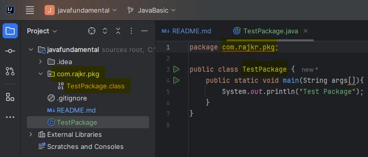
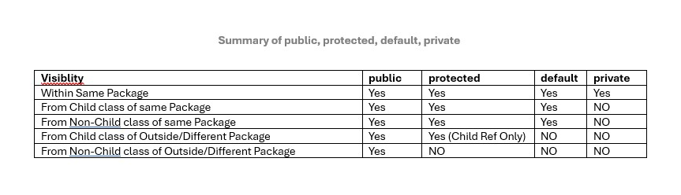
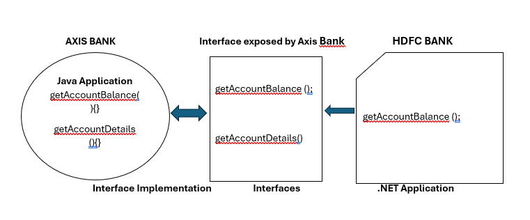

# **Java Fundamental**

## Java Source File Structure

#### Public Class In a File

A file can have multiple Java Classes. But maximum one class can be public.

If anyone of the class is public in a file then file can be saved with public class name.

#### No Public Class In a File

If no class is public then file can be saved with anyname.

#### Import Statement

For Best practices or readability always go with Explicit Import instead of Implicit Import. For example -

Best( Explicit Import ) => import java.util.ArrayList

Bad( Implicit Import ) => import java.util.*

Import statement, is not required for classes, packages etc if they are in same/current working directory.

Whatever available in "java.lang.*" packege, import statement is not required because by default they are available.

*Whenever we are importing a package ("import java.* ") then all classes, packages, interfaces inside package are available except sub-package for example" import java.* "  => Here java is a package. so all classes, interfaces and packages will be available from java package but not sub package classes like util" import java.util.* " => Here util is a sub-package inside java package. so all classes, interfaces and packages will be available from java.util package but not sub package like regex" import java.util.regex.* " => Here regex is a sub-package inside java.util sub-package.*

### Package

Package is a group of related classes, interfaces. For example java.io package

Package is best example of encapsulation

It improves modularity. Below is best example of Date class. we can have more then one classes with same name and they can belong to some related package. so it improves modularity

```
import java.util.Date
import java.sql.Date
```

it improves readiblity

it improves security. Related classes, interfaces inside package can access it's own content but outsider won't be able to access it.

Steps to compile package: -

1. javac TestPackage.java

. class file will be generated in CWD

2. javac -d . TestPackage.java ( . => CWD, we can specify any directory for example - javac -d D: TestPackage.java)
   This will put .class file in CWD com.rajkr.pkg

   
3. Run a package
   java com.rajkr.pkg.TestPackage
4. Maximum one package declaration statement is allowed in a Java Program file
5. Order to create a package: firstly Max one package statement > 2ndly Any no of import statement > lastly Any no of: Class | Interface | Enum

## Top level Class Modifiers( public, default, abstract, final, strictfp ):

`class Top {class Inner{}}`

#### Access:

public => Class accesible from anywhere.

default => Class accesible within the same package.

#### Object Creation:

**abstract**: Object creation( or Instance creation ) is not possible for abstract class.

**non-abstract**: Object creation( or Instance creation ) is possible if class is not abstract.

**final**: If class is final, then child class creation is not possible.

**not final**:  If class is not final, then child class creation is possible.

## Inner Class level Modifiers( *public, default, abstract, final, strictfp*, **private, protected, static** ):

`class Top {class Inner{}}`

## Abstract(-> Incomplete )  Modifier

1. Applicable for Methods - Abstract Methods ends with semicolon not with curly bracket; Child classes are reponsible for implementation of the abstract methods.
   Valid signature is - `public abstract int getInterstRate();`

```
public class Vehicle { 
 public abstract int getNoOfWheels();  // Vehicle wheels is unknown because it can be 2, 3, 4, etc
}

public class Fruits{
 public abstract string getTaste();  // Taste is unknow because it depends on fruit
}

public class Loan{
 public abstract int getInterstRate();  // Interest is is unkown because it depends on loan type like Education loan, Home Loan, Personal Loan etc
}

```

2. Applicable for Class - we can declare a class as *abstract* if we feel implementation is incomplete. Like a class implementation can be incomplete or a method can have incomplete implementation.
   Object Creation( Instantation ) is not allowed for Abstract class.
3. Difference between abstarct method and abstract class:
   If a class has at least one abstract method then class must be declared as Abstract class. So object creation is not possible.
   If a class doesn't have abstract method even though that class can be declared as Abstarct class.
   If child class is not abstract and it extends some abstract class then all abstract method of abstract class has to be implemented by Child Class( If it is not abstract)

   If child class is abstract and it extends some abstract class then all abstract method of parent abstract class not required to be implemented by Child Class( If it is abstract).

   But make sure at any level Object creation is not possible if that class is abstract even though it has implemented it's parent abstract method.

```

abstract class Vehicle {
 public int getNoOfWheels(){
 };  // here implementation is incomplete so this class can be declared as abstract class
}

abstract class Fruits{
public abstract string getTaste();  // Taste is abstract method so class must be declared as abstract class
}

// If Parent class is abstract and it has abstract method. so next child class must implements the abstract methods otherwise Compile time error will be thrown
abstract class Test {
 public abstract void m1();
 public abstract void m2();
}
// Object creation is not possible for ChildTest class because complile time error will be thrown
class ChildTest extends Test {
 public void m1() {}; // Complile time error for m2() method-> so implement m2: public void m2() {};  or declare ChildTest as Abstract also
}

// Object creation is possible for ChildTest class because it has implemented it's parent abstract methods, m1 & m2
class AnotherChildTest extends Test {
 public void m1() {}; 
 public void m2() {};
}
```

5. When an abstract class is required to have abstract method -
   If you want each child to implement abstract method then please declare a abstract method in parent abstract class.

   ```
   abstract class Vehicle {
    public abstract int getNoOfWheels(){
    };
   }
   ```

   If implementation decision is dependent on child class in that case abstract method declaration is not required in parent abstract class.

   ```
   abstract class Vehicle {}
   ```

## Members(methods or variables) Modifiers =>  **public** & **default**

### public-Global Access & **default**-accessible within it's own package:

if a class is public then it can be accessed from anywhere.

```
// A.java  => javac -d . A.java
package pack1;

public class A {
    void m1() {
        Sopln("A class method");
    }
}

// B.java  => javac -d . B.java
package pack2;
import pack1.A;

public class B {
    public static void main(String args[]) {
        A a = new A(); // Compile time error will be thrown here
        a.m1();
    }
}
```

if a class is public but it's member are not public( for example it's default ) then its emeber can be accessed inside it's own package.

```
// A.java  => javac -d . A.java
package pack1;

public class A {
    void m1() {
        Sopln("A class method");
    }
}

// B.java  => javac -d . B.java
package pack2;
import pack1.A;

public class B {
    public static void main(String args[]) {
        A a = new A();
        a.m1(); // Compile time error will be thrown here
    }
}
```

if a class is public and it's members are also public then class can be accessed from anywhere.

```
// A.java  => javac -d . A.java
package pack1;

public class A {
    public void m1() {
        Sopln("A class method");
    }
}

// B.java  => javac -d . B.java
package pack2;
import pack1.A;

public class B {
    public static void main(String args[]) {
        A a = new A();
        a.m1();
    }
}
```

if a class is not public it can't be accessed from outside it's own package even though it's members are public.

```
// A.java  => javac -d . A.java
package pack1;

class A {
    public void m1() {
        Sopln("A class method");
    }
}

// B.java  => javac -d . B.java
package pack2;
import pack1.A;

public class B {
    public static void main(String args[]) {
        A a = new A();
        a.m1();
    }
}
```

### Private ( Accessible within it's own class ):

*Recommended modifier for Class Variables is PRIVATE*

*Recommended modifier for Class Methods is PUBLIC*

Private member(methods & data member/class variables) are accessible within it's own class.

```
class A {
    private void m1() {
        Sopln("A class private method");
    }
}

class Test {
    public static void main(String args[]) {
        A a = new A();
        a.m1(); // Compile Time error will be thrown - m1 has private access in A
    }
}
```

```
class A {
    private void m1() {
        Sopln("A class private method");
    }
}

public class Test {
    public static void main(String args[]) {
        A a = new A();
        a.m1(); // Compile Time error will be thrown - m1 has private access in A
    }
}
```

### Protected Modifiers( Access within it's own package i.e default + child class level access )

Within it's own package it can be accessed by Parent class reference, Child class reference

```

class A {
    public void m1() {
        Sopln("A class method");
    }
}

class B extends A {
    public static void main(String args[]) {
  
    }
}

// Allowed access ways are
A a = new A();
a.m1();

B b  = new B();
b.m1();

// Here B class have access m1 method in A. So using B class reference it can be accessed
A a1 = new B();
a1.m1()
```

##### Inside same package - Accessible by parent class refrence and Child class reference

```
// Both classes are in same package - pack1, A is parent class and B is Child class.       javac -d . A.java => java pack1.B
package pack1;
class A {
    protected void m1() {
        Sopln("A class protected method");
    }
}

class B extends A {
    public static void main(String args[]) {
        A a = new A();
        a.m1();

        B b = new B();
        b.m1();

        A a1 = new B();
        a1.m1();
    }
}
```

###### Outside package - Only within Child Class( by Child class reference only )

What if child class exist outside another Package - pack2

```
// Class A is in package - pack1, and Class B is in package- pack2
package pack1;

class A {
    protected void m1() {
        Sopln("A class protected method");
    }
}
---------------------------------------------------
package pack2;
import pack1.A;

public class B extends A {
    public static void main(String args[]) {
        A a = new A(); // Compile Time Error because of Parent refrence - m1 has protected access in pack1.A
        a.m1();

        B b = new B(); // Valid because of Child refrence is used
        b.m1();

        A a1 = new B(); // Compile Time Error because of Parent refrence - m1 has protected access in pack1.A
        a1.m1();
    }
}
```



## **Object Oriented Programming**

1. Interface -
2. Abstract Class

### INTERFACE - Interface is Any service requirement specification ( SRS )

- Any service requirement specification( SRS ) for example - SUN Microsystem provides JBDC API requirements(SRS) for Java Applicaation to interact with any database like Oracle, MySQL, PostgreSQL( All Database vendor have used SUN System SRS to develop database driver so that Java Application can interact) .
  If you want your java application to interact any new database then you have to follow the SUN Microsystem SRS to create driver which will interact with Database.
- Any contract b/w Client and Service Provider is also know as Interfaces

```
// By default Interface methods are public and abstract
// Modifier from Interface can't be narrowed(like public to default/protected/Private) by implemented Service class
interface CollegeInterface {
    public void attendance();
    public void absence();
    public void fee();
}

abstract class ServiceProvider implements CollegeInterface {
    /**
     * For All interface method we must be provide implementation and they must be public
     * If yoy are not able to provide the implementation of at least one method of interface then ServiceProvider class must be declared as abstract class
     * If any method implementation left then Sub Child class is responsible to implements the not implemented abstract method from interface
     */
    public void attendance() {

    };
    public void absence(){

    };
}

class SubServiceProvider2 extends ServiceProvider {
    /**
     * All method from interfaces must be implemented and they must be public
     * Here pending abstract public method from interface is implemented by SubServiceProvider2
     * 
     */

    public void fee(){

    };
}

```

## **Object Oriented Programming ( OOPS )** Features

### **Data Hiding** - Data hiding for security reason so that outsider can't access

***Private modifier*** can be user for data member for data hiding

```
interface Account {
    // Data hiding can be achieved by private modifier
    private double balance;

    public double getAccountBalance() {
        // perform validation for valid PIN credentails
        if ( isValidPIN )
          return balance;
        else 
            return error;
    }
}
```

### Abstraction - Hiding Internal implementation due to security reason

***Abstraction can be achieved by GUI and Interfaces***

For Example -> Bank hides internal implementation- like code and sql query, how user balanced is fetched by showing needed features using GUI.

Advantages of Abstraction:

* Security
* Enhancement becomes easy - Internal Implementation or technology can be changed because GUI and interfaces will remain same, So user and outside 3rd party services won't be affected
* Maintainaility is going to be improved
* Modularity is going to be improved



### Encapusalation (=> Data Hiding + Abstraction )

###### The process of encapsulating/groupping in a single class is called Encapusalation.

Every Java class is an example for Encapusalation.

Hiding data members behind the methods is called Encapusalation.

Big Disadvatnage is - Performance will decrease because length of the code will increase like validation that will increase execution time

```
// Here GUI ( Balance Enquiry, Deposit buttons) plays a role of abstraction and private modifier in a class plays data hiding role
class Account {
    // Data hiding can be achieved by private modifier
    private double balance;

    public double getAccountBalance() {
        // perform validation for valid PIN credentails
        if ( isValidPIN )
            return balance;
        else
            return error;
    }

    public void setAccountBalance(double amound){
        // perform validation for valid PIN credentails
        if ( isValidPIN )
            this.balance = this.balance + amound;
        else
            return error;
    }
}

```

#### Tightly Encapsulated Class(All variables in a class is declared as Private, we don't care about methods, it can have any applicable modifiers):

If parent class is not Tightly Encapsulated then all child will also become Non-Tightly Encapsulated class

Example - 1

```
//Tightly Encapsulated Class
class A {
   private int x = 10;
}

//Non - Tightly Encapsulated Class, because y is not private
class B extends A {
    int y = 20;
}

//Tightly Encapsulated Class
class C extends A {
    private int Z = 30;
}

```

Example - 2

```
//Non - Tightly Encapsulated Class, because x is not private
class A { 
    int x = 10;
}

//Non-Tightly Encapsulated Class, because Class B inherit class A, Hence x is also part of B
class B extends A {
  private int y = 20;
}

//Non-Tightly Encapsulated Class, because Class C inherit class B, Hence x, Y is also part of C
class C extends B {
    private int Z = 20;
}
```

### Inheritance:

1. Is-A Relationship
2. Code Reusability
3. extends keyword


Child class member cannot be part of Parent Class

All member of parent class will be available in child class

Parent reference can be used to hold child object. But using parent reference we can't call Child class members

Child reference can be used to hold child object. Child reference can call Parent class members

Parent reference can be used to hold child object. But using parent reference we can't call Child class members


Example-1

```
//Child class member cannot be part of Parent Class
class Parent {
    int x1 = 10;
    String s1 = "Parent Variable";

    public void m1() {
        System.out.println("Parent Method");
    }
}

//All member of parent class will be available in child class
class Child extends Parent {

    int y1 = 10;
    String t1 = "Child Variable";

    public void m2() {
        System.out.println("Child Method");
    }
}

class Test {
    public static void main(String[] args) {
        //Parent reference can be used to hold Parent object. Parent reference can only call it's parent class members but not child class members
        Parent p = new Parent();
        p.m1();
        p.m2(); // Error

        // Child reference can be used to hold child object. Child reference can call Parent class members
        Child c = new Child();
        c.m1();
        c.m2();

        // Parent reference can be used to hold child object. But using parent reference we can't call Child class members
        Parent parent = new Child();
        parent.m1();
        parent.m2(); // Error
    }
}
```


Note - 4300+ class are available in Java

1. Object class is the root class for all the classes in Java.
2. Object class is the root class for all Java classes because it contains all the common method which are required for any Java Class.
3. String, StringBuffer, Number, Math..... Throwable are direct child class of Object class
4. Throwable contains all common methods for Exception and Error class
5. RuntimeException(RE childs are => NullPointerException, ArithematicException etc), IOException etc are direct child of Exception class.
6. So, Exception class contains all common methods for RE, IOE etc
7. VMError, CompileTimeError, etc are direct child class of Error class.
8. So, Error class contains all common methods for VMError, CE etc

**Any class created by user will be direct child class of Object class only if it doesn't extends any other class**.

Example -

// Class A inherits Object class
Object => class A

// only class A inherits Object class but not B

class B extends A


#### Types of Inheritance:

1. Single Inheritance: - Single child class inherits Single parent class is called Single Inheritance
2. Multiple Inheritance ( Not supported in Java class except Interface ):  - Single child class inherits multiple Parent class at a time is called Multiple Inheritance
3. Multi-level Inheritance: - Class A => Class B extends A => Class C extends B
4. Hierarchical Inheritance - A group of single inheritance is Hierarchical Inheritance.
5. Hybrid Inheritance ( Not supported in Java class except Interface - because interface contains only method declaration ) - Combination of two or more Inheritance types
6. Cyclic Inheritance ( Not supported in Java class or interface) - For example - Class A inherits B ,   Class B inherits A   i.e class A <=> class B

**Single Inheritance**

```
class Parent {
  
}

class Child extends Parent {
  
}
```

**Multiple Inheritance:** - Not supported because of Diamond Access problem or Ambiguity Problem

```
class A {
    public void m1() {
        System.out.println("Parent Method");
    }
}

class B {
    public void m1() {
        System.out.println("Parent Method");
    }
}

class C extends A,B{
    //which m1 method will be called. 
}
```

**Multi-level Inheritance**

```
class A {

}

class B extends A {

}

class C extends B {
  
}
```

**Hierarchical Inheritance**:

```
class Parent {
    public void m1() {
        System.out.println("Parent Method");
    }
}

class A extends Parent{
//Calling m1 method is possible without any error.
}

class B extends Parent{
//Calling m1 method is possible without any error.
}

class C extends Parent{
//Calling m1 method is possible without any error.
}
```


**Hybrid Inheritance**

```
class A {
    public void m1() {
        System.out.println("Parent Method");
    }
}

class B extends A {

}

class C extends B{
  
}

class D extends C{
    public void m1() {
        System.out.println("Parent Method");
    }
}

class E extends C {
    public void m1() {
        System.out.println("Parent Method");
    }
}

class F extends D, E {
  //which m1 method will be called. 
}
```

Hybrid Inheritance for Interface -

```
interface A {
    public void m1();
}

interface B {
    public void m1();
}

interface C extends A,B {

}

class D implements C {
    public void m1() {
        System.out.println("Parent Method");
    }
}
```


### Polymorphism ( Overloading -*is different method signature* & Overriding is - *same method signature* ):

**Method Signature** => ( Method name + Method Arguments ), not method return type. Compiler uses methods signature to resolve calls. 
if calls does.t match, compile time error will be thrown.


*Two methods with same signature is not allowed in a class.*


#### Overloading(Same method name but different arguments type):
